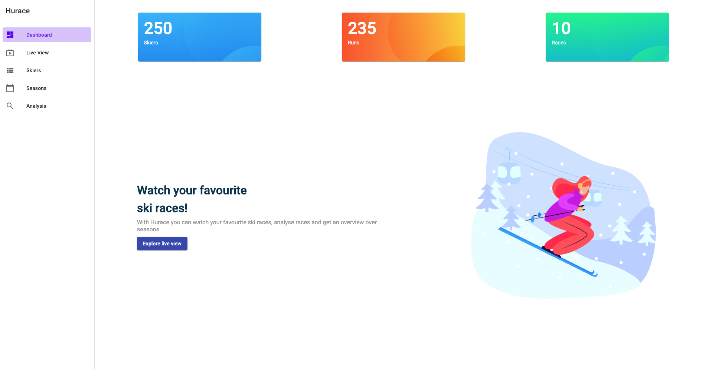

# Hurace

A web app as part of the Hurace project in WEA5UE/SWK5UE WS1920 at [FH OÖ Campus Hagenberg](https://www.fh-ooe.at/en/hagenberg-campus). The system itself manages ski events and skiers.

## 🚀 Getting started

### Development server

Run `ng serve` for a dev server. Navigate to `http://localhost:4200/`. The app will automatically reload if you change any of the source files.

### Build

Run `ng build` to build the project. The build artifacts will be stored in the `dist/` directory. Use the `--prod` flag for a production build.

### Running unit tests

Run `ng test` to execute the unit tests via [Karma](https://karma-runner.github.io).

### Running end-to-end tests

Run `ng e2e` to execute the end-to-end tests via [Protractor](http://www.protractortest.org/).

## 🎪 Showcase

**Dashboard**

**Live view**

**Skier management**

**Seasons**

**Analysis**

## 📝 Credits
* [Icons](https://www.freepik.com)