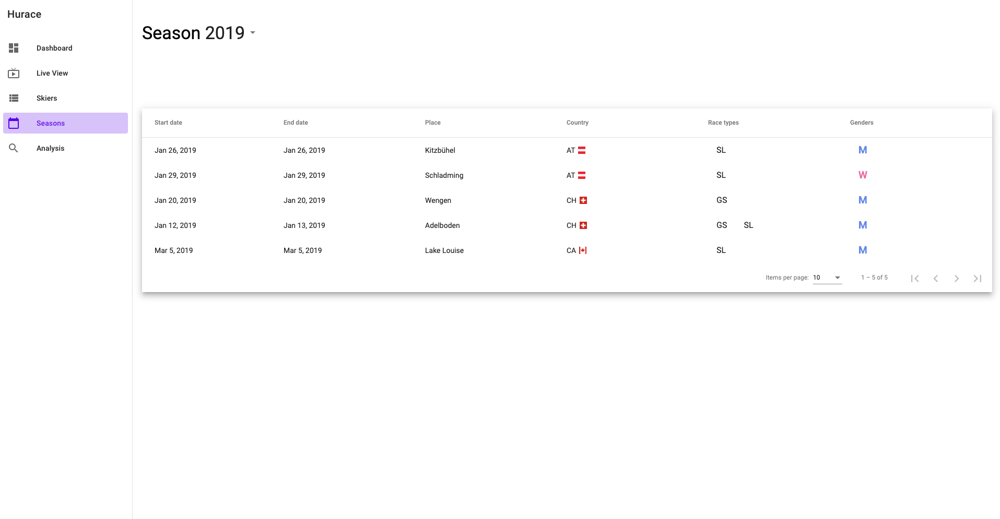

# Scope of implementation and effort

* Effort: ~36h

**Not implemented features**

* The race analysis does not show the amount of first, second and third places of a skier.

# Deployment

## Development server

Run `ng serve` for a dev server. Navigate to `http://localhost:4200/`. The app will automatically reload if you change any of the source files.

## Build

Run `ng build` to build the project. The build artifacts will be stored in the `dist/` directory. Use the `--prod` flag for a production build.

## Running unit tests

Run `ng test` to execute the unit tests via [Karma](https://karma-runner.github.io).

## Running end-to-end tests

Run `ng e2e` to execute the end-to-end tests via [Protractor](http://www.protractortest.org/).

## Running as docker image

Run `docker run -d -p 80:80 ammerzon/hurace-frontend` to start a container. The image contains a nginx webserver and exposes port 80.

## Running in Kubernetes cluster

Configure the **API_BASE_URL** environment in *kubernetes.yaml* and then run `kubectl apply -f kubernetes.yaml` to create a deployment and a service for a Kubernetes cluster. The configuration also adds an ingress to reach the webserver under `<ip>/hurace-frontend`.

# Showcase

**Dashboard**

This page is the entry point of the web app and displays **analytics** like the amount of skiers, runs and races. 


**Live view**

The live view shows the current skier including the intermediate times during a race. The page itself uses **polling** to refresh the data in the background. On the bottom you see the current leaderboard and with the buttons at the top bar you can switch between the first and the second run.


**Skier list**

This screen lists all skiers in the system and offers **pagination**, **ordering** and **filtering**. When a user is not logged in the edit, add and delete buttons are removed to protect from unauthorized access.


**Skier create**

This page is shown when you click on the fab button in the bottom right corner of the skier list. It offers a **form** to add the required information of a skier and shows a preview of them on the right side. All of the form input fields are **validated** and show a red indicator if they do not match certain criteria. 


**Skier update**

This screen is similar to the creation of a skier but also offers the option to **nominate** a skier for a race (add the skier to the end of thestart list).


**Seasons**

This page lists all the seasons and offers **pagination** and **ordering**. It also shows the race types and the gender of the events at a certain location.



**Season details**

This page shows all the events at a specific location in a season. A **status indicator** visualizes whether the event is in progress, ready or already finished.


**Analysis**

The analysis page allows to **compare the intermediate times** of two different skiers. With the buttons at the top bar you can switch between the first and the second run.


# Architecture


## Used libraries
* **[angular/material](https://www.npmjs.com/package/@angular/material)** as UI framework
* **[moment](https://www.npmjs.com/package/moment)** for time parsing
* **[ng-lazyload-image](https://www.npmjs.com/package/ng-lazyload-image)** for displaying images
* **[angular-oauth2-oidc](https://www.npmjs.com/package/angular-oauth2-oidc)** to authenticate with the identity server
* **[material/drawer](https://www.npmjs.com/package/@material/drawer)** for the side navigation

## [Folder structure](https://angular-folder-structure.readthedocs.io/)


* **Core** module: This module is for classes used by app.module and contains all pipes, validators and services like authentication.
* **Layout** directory: This directory contains components which are used in the AppModule. Common examples are the side navigation or the content layout. By using child routes top level routes can define a layout to be used for its children.
* **Module** directory: This directory contains a collection of modules which are independent of each other. In this example the analysis, the home view, live view, seasons and the skier screens. Also each module has it's own routing and must provide a base path.
* **Shared** module: This module contains classes which are needed more than once. For example the `ReactiveFormsModule`, the Material components or custom directives.

## openapi-generator 

To consume data from the Hurace REST service the [openapi-generator](https://github.com/OpenAPITools/openapi-generator) is used to create the necessary types and services (each REST endpoint [collection](https://restfulapi.net/resource-naming/) is a service). By running `./scripts/generateClient.sh` the generator creates a `hurace-client` folder with all the necessary client API files and also a packaged NPM library. This library can then be included in the main project by adding the following line `"@hurace-client/api": "file:scripts/hurace-client/hurace-client-api-1.0.0.tgz"` to `package.json`.

**Example of a generated service**
```{.ts include=../scripts/hurace-client/api/countries.service.ts startLine=30 endLine=83}
```

## Authentication

## Custom directives
Common behaviour is extracted into own directives:

### Gender indicator


### Status indicator


### An image directive for lazy loading images


### A top bar to switch between runs


# Improvements

Reflecting my own work, there are also areas which can be improved. Espescially the autocomplete component of races and skiers could be refactored into a own directive because at the moment this generates dupicate code.


